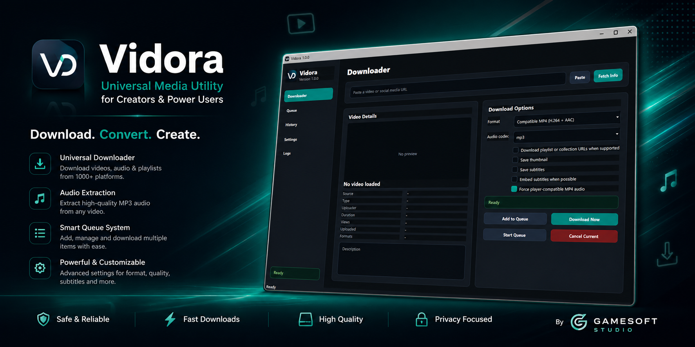
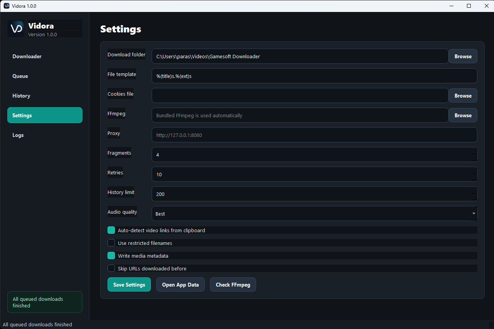

# Vidora

A modern desktop media utility built for creators, editors, developers, and everyday users.

Vidora makes it easy to download, convert, organize, and manage media through a clean desktop interface with queue support, format controls, subtitle options, and more.

---

# Download

## Latest Release

👉 [Download Vidora for Windows](../../releases/latest)

* Installer included
* No Python installation required
* FFmpeg bundled automatically

---

# Features

## Media Downloads

* Download videos and audio from supported platforms
* Extract MP3 audio
* Playlist and collection support
* Subtitle downloading
* Thumbnail saving
* Metadata fetching

## Queue System

* Add multiple downloads to queue
* Start and manage queue downloads
* Cancel active downloads
* Real-time progress tracking

## Media Tools

* Compatible MP4 conversion
* Audio codec selection
* FFmpeg integration
* Player-friendly export options

## Desktop Experience

* Modern dark interface
* Clipboard URL detection
* Drag & drop support
* Download history
* Persistent settings
* Runtime FFmpeg detection

---

# Screenshots

## Main Interface

---

## Queue System

---

## Completed Queue

---

## Settings

---

## Media Details

---

# Installation

1. Download the latest installer from the Releases page
2. Run `Vidora-Setup.exe`
3. Complete the installation
4. Launch Vidora and start downloading

---

# Built With

* Python
* PyQt5
* yt-dlp
* FFmpeg

---

# Disclaimer

Vidora is intended for personal media management and offline access where permitted.

Users are responsible for complying with the terms of service and copyright laws of the platforms they access.

---

# Credits

This project uses several open-source technologies including:

* yt-dlp
* FFmpeg
* PyQt5

---

# Feedback

If you encounter a bug or would like to suggest a feature, feel free to open an issue on GitHub.

---

# Developed By

### Gamesoft Studio
